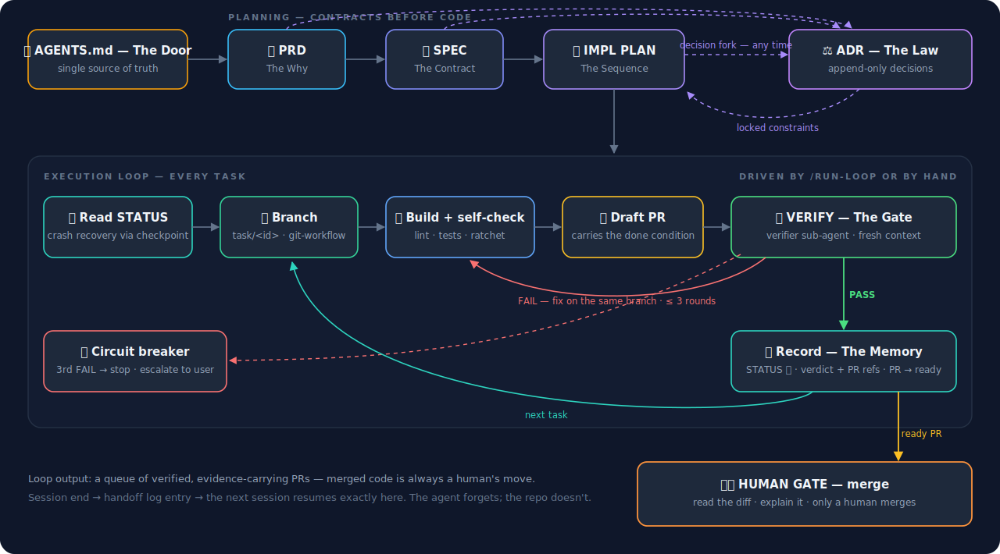

# Agentic Engineering — Documentation-First Development

> Ten chain skills that give coding agents persistent memory, zero-ambiguity contracts, documentation that stays true as the project evolves, a git contract for how code lands, an independent definition of "done", and a reverse-engineering on-ramp for existing codebases — plus a router and a verify-gated loop driver, shipped as both commands and skills. The harness layer for long-running, loop-driven development.

## The Core Problem

**AI Agents are stateless.** Every new session starts from zero — your naming conventions, error handling patterns, architectural constraints are unknown. Without structured documentation, the Agent guesses, causing **context collapse**: code that runs but is architecturally incoherent.

> *The most effective agentic coding workflow starts before the first prompt — with a written spec the agent builds to, not assumptions it makes on its own.* — [Blink](https://blink.new/blog/agentic-coding-best-practices)

**What this suite solves:**

- Agent produces code that contradicts existing architecture → **SPEC provides the contract**
- Agent makes decisions you already resolved → **ADR preserves decision history**
- New session has no idea what happened last time → **STATUS provides memory**
- Agent builds the wrong thing → **PRD defines what and why**
- Agent does tasks in wrong order or scope → **IMPL PLAN defines the sequence**
- Agent claims "done" when it isn't → **VERIFICATION makes done a verdict, not a claim**
- Code lands as untraceable commits on main → **GIT WORKFLOW ships each task as an evidence-carrying PR**
- Crash mid-session loses all progress → **STATUS checkpoints at task granularity**
- Docs say one thing, the code does another → **DOC MAINTENANCE keeps the chain true to reality**
- Adopting the workflow on an existing codebase means starting from zero → **ONBOARDING reverse-engineers the as-built chain**
- Tools each demand their own config → **AGENTS.md is the single entry point**

## How the Skills Flow



ADRs can be triggered at any point along the chain — whenever a decision fork appears in PRD, SPEC, or IMPL PLAN work. VERIFY loops every task: build → independent verdict → only PASS marks ✅. STATUS loops every session forever. Code travels per GIT WORKFLOW: a branch per task, a draft PR carrying the done condition, ready only on PASS, merged only by a human. Projects with an existing codebase enter through ONBOARDING, which reverse-engineers the as-built chain before the flow begins; and whenever a conversation makes a document stale, DOC MAINTENANCE catches the drift and folds gated, user-approved updates back into the chain.

## The Skills

Each skill is a directory containing a `SKILL.md` (the shared format used by Claude Code and Codex). Click any skill for its core mechanisms.

<details>
<summary><b>1. <a href="skills/agents-md-template/SKILL.md">agents-md-template</a> — The Door</b> · bootstraps <code>AGENTS.md</code> as the single source of truth every tool points to</summary>

*Bootstraps a repo with `AGENTS.md` as the single source of truth every agent reads before doing anything.* Produces `AGENTS.md` + pointer files.

| Mechanism | What it does |
|-----------|--------------|
| **One door** | `CLAUDE.md`, `copilot-instructions.md`, `.cursor/rules/` are one-line pointers to `AGENTS.md` — every tool gets identical instructions, zero config drift |
| **Six-section anatomy** | Project identity → documentation chain → coding conventions → architecture constraints → boundaries → verification |
| **Session protocol** | Read memory → code by contract → checkpoint per task → independent verification → handoff. The agent's standing orders for every session |
| **Explicit boundaries** | A "must NOT" list: no self-grading, no deleting tests to go green, no redefining "done" mid-task, no relitigating locked decisions |
| **Three-layer verification** | Producer self-check (necessary, never sufficient) → independent gate (fresh-context PASS required) → human gate (read the diff before merge) |

</details>

<details>
<summary><b>2. <a href="skills/project-kickoff-prd/SKILL.md">project-kickoff-prd</a> — The Why</b> · phased dialogue that turns a rough idea into a prioritized PRD</summary>

*Turns a rough idea into a structured PRD through phased dialogue — the agent is a co-creator, not a note-taker.* Produces `docs/prd.md`.

| Mechanism | What it does |
|-----------|--------------|
| **Co-creator stance** | The agent challenges weak assumptions, surfaces forgotten edge cases, and makes recommendations — it never just transcribes |
| **Five-phase dialogue** | Problem & vision → features & boundaries → technical direction → extensibility → structured PRD. One phase at a time, confirmation gate between each |
| **Priority triage** | Every feature lands in P0 (product fails without it) / P1 (ship a week later) / P2 (defer), with explicit out-of-scope and the reasons why |
| **Convergence pressure** | 2–4 exchanges per phase, never a 20-question interview; vague scope ("it should handle everything") is rejected with "give me three examples" |
| **ADR candidate flagging** | Consequential choices made mid-dialogue are flagged for capture before they silently become architecture |

</details>

<details>
<summary><b>3. <a href="skills/technical-specification/SKILL.md">technical-specification</a> — The Contract</b> · zero-ambiguity specs with machine-verifiable acceptance criteria</summary>

*Hardens the PRD into implementation contracts any agent can build from with zero prior context and zero follow-up questions.* Produces `docs/spec/[domain].md`, one per bounded context.

| Mechanism | What it does |
|-----------|--------------|
| **Zero-ambiguity rule** | Every number concrete, every boundary has a violation response, "etc." is banned, "should/may" become "must/must not" |
| **Bounded-context split** | One spec per domain; a spec past 500 lines is covering too much and gets split |
| **Six-phase coverage** | Data model (with invariants) → API contracts (rate limits, idempotency, retries) → state machines (invalid transitions defined) → error taxonomy → non-functional requirements → acceptance criteria |
| **Machine-verifiable criteria** | Every acceptance criterion binds **Verify via** (the exact command) + **Evidence** (what output proves it); human-judgment checks are explicitly `MANUAL` — and treated as a smell |
| **Immutable once approved** | Changes require a new version, a changelog, and the ADR that motivated them — the contract can't drift under the implementer |

</details>

<details>
<summary><b>4. <a href="skills/architecture-decision-record/SKILL.md">architecture-decision-record</a> — The Law</b> · append-only decision history with trade-offs and review triggers</summary>

*Captures every decision fork with context, options, and trade-offs — append-only, written for the reader six months from now.* Produces `docs/adr/ADR-NNN-[slug].md`.

| Mechanism | What it does |
|-----------|--------------|
| **Fork detection** | The agent recognizes "X or Y?" moments — including implicit ones ("let's just use X") — and proposes capturing them before they evaporate |
| **Append-only history** | Accepted ADRs are never edited; they're superseded by new ones. History stays honest, numbers are never reused |
| **Fair options analysis** | Rejected options keep their real advantages on record — no strawmanning; future readers may revisit them when context changes |
| **Reversibility + review triggers** | Every decision records how hard it is to undo (Easy → Irreversible) and the concrete conditions for reconsidering it |
| **Anti-relitigation** | Locked decisions are quick-referenced in `AGENTS.md` and STATUS — agents don't reopen them without the user |

</details>

<details>
<summary><b>5. <a href="skills/implementation-plan/SKILL.md">implementation-plan</a> — The Sequence</b> · dependency-ordered atomic tasks with locked done conditions</summary>

*Decomposes approved specs into dependency-ordered atomic tasks any agent can execute in a single session.* Produces `docs/plans/implementation-plan.md`.

| Mechanism | What it does |
|-----------|--------------|
| **Atomic tasks** | Self-contained, ≤ 90 minutes, ≤ 5 files, with named file paths and spec references — zero reading between the lines |
| **Dependency order, not importance** | The flashy feature waits for its boring infrastructure; every milestone ends in demonstrable state you can run, show, or prove |
| **Locked done conditions** | Each task's acceptance criteria bind executable commands and are frozen at task start — the executing agent cannot weaken them mid-run |
| **Done is a verdict** | A task completes when the independent verifier returns PASS — never when the producer claims it |
| **Worktree isolation** | Parallel tasks get parallel git worktrees, merging through the verification gate; review bandwidth, not git, is the real parallelism ceiling |
| **Risk register + rollback points** | Risks acknowledged before they become surprises; milestones double as safe pause-or-pivot points |

</details>

<details>
<summary><b>6. <a href="skills/independent-verification/SKILL.md">independent-verification</a> — The Gate</b> · fresh-context verifier turns "done" into an evidence-backed verdict</summary>

*The maker-checker gate: a verifier with fresh context executes the done condition as written and returns a verdict with evidence.* Produces `docs/verification-log.md`.

| Mechanism | What it does |
|-----------|--------------|
| **Role separation** | The producer builds and self-checks; a separate verifier judges. The model that wrote the code never grades it |
| **Fresh-context requirement** | The verifier runs as a sub-agent or fresh session and never sees the producer's conversation — inherited reasoning means inherited blind spots |
| **Evidence-based verdicts** | Binary PASS/FAIL per criterion with commands, exit codes, and key output — "looks good" is not a verdict |
| **Test ratchet** | The suite count only goes up; a deleted or skipped test is an automatic FAIL regardless of everything else |
| **Circuit breaker** | Three consecutive FAILs on one task stops the loop and escalates to the user — no infinite fix-verify ping-pong |
| **Human gate** | A machine PASS is necessary, not sufficient: a human reads the diff and can explain it before merge |
| **Cost discipline** | Dual-opinion where stakes justify it — always for main, data, auth, money; a cheaper model is fine for mechanical checks |

</details>

<details>
<summary><b>7. <a href="skills/status-tracker/SKILL.md">status-tracker</a> — The Memory</b> · live progress, in-run checkpoints, crash recovery, session handoffs</summary>

*The bridge between sessions: live progress, in-run checkpoints, and an append-only handoff log.* Produces `docs/status.md`.

| Mechanism | What it does |
|-----------|--------------|
| **Session handoff log** | Append-only, newest first: what was built, how it connects, what was verified (exact counts), caveats, and the literal next action |
| **In-flight checkpoint** | Updated at task granularity during the session — a crash costs at most one task, never the session |
| **Crash detection** | A checkpoint that isn't `none` at session start means the last session died mid-work; the checkpoint is the recovery point |
| **Four-state lifecycle** | ⬜ not started → 🟡 in progress → 🔍 built, awaiting verification → ✅ verified done. ✅ requires a verifier verdict, not a producer claim |
| **Numbers discipline** | "232/232 pytest", named files, named components — vague entries ("made progress") are banned |

</details>

<details>
<summary><b>8. <a href="skills/git-workflow/SKILL.md">git-workflow</a> — The Road</b> · branch per task, evidence-carrying draft PRs, merge only through both gates</summary>

*Defines how code actually lands: one branch and one PR per task, verification evidence in the PR, merge gated by verdict and human.* Produces task branches + draft PRs.

| Mechanism | What it does |
|-----------|--------------|
| **Protected main** | main is read-only for agents — no exceptions, including "trivial" fixes |
| **One task, one branch, one PR** | `task/<task-id>-<slug>` named from plan task IDs; traceability runs diff → PR → task → spec |
| **Evidence-carrying PRs** | The PR description holds the done condition and the verdict reference — review starts from the contract, not the raw diff |
| **Draft until PASS** | PRs are born draft; ready-for-review is earned by the verifier's PASS, never by the producer's confidence |
| **Double-gated merge** | Verifier PASS + a human who read the diff; the agent never merges its own PR — in unattended loops, merge is always the human's move |
| **Evidence integrity** | No history rewriting once verification starts; branches deleted only after merge |
| **Worktree isolation** | Parallel agents get one worktree each — mechanical conflicts solved, human review bandwidth still the ceiling |

</details>

<details>
<summary><b>9. <a href="skills/documentation-maintenance/SKILL.md">documentation-maintenance</a> — The Caretaker</b> · keeps PRD/SPEC/ADR/IMPL PLAN true as the project evolves — gated by user approval</summary>

*The chain is only worth trusting if it stays true. When the conversation outruns the documents, this skill catches the drift, proposes the fix, and folds it back in — never without the user's nod.* Produces gated updates to the affected chain docs.

| Mechanism | What it does |
|-----------|--------------|
| **Drift detection** | Watches every conversation for decisions the docs don't yet reflect — scope, contract, decision, plan, convention, as-built. The test: *would a fresh agent reading only the docs now build the wrong thing?* |
| **Permission gate** | Never edits a fundamental doc silently. Surfaces a diff-level proposal — exact doc, section, and change — and waits for the user's explicit yes |
| **New-feature workflow** | "I want to add X" routes through PRD → ADR → SPEC → IMPL PLAN *before* any code, so every feature lands with a contract, a decision record, and a plan — not as an undocumented patch |
| **By-the-rules application** | Append-only ADRs, versioned specs, protected completed tasks — maintenance updates reality without rewriting history |
| **Nothing falls through** | Applied changes hit the STATUS handoff log; drift the user defers parks as an Open Item, never a forgotten contradiction |

</details>

<details>
<summary><b>10. <a href="skills/existing-project-onboarding/SKILL.md">existing-project-onboarding</a> — The On-Ramp</b> · reverse-engineers a brownfield codebase into the as-built chain — changes docs, never code</summary>

*Points the suite at a codebase that already exists: reads the system as it actually is and reconstructs the chain as-built, so the next agent inherits an accurate map instead of guessing.* Produces the as-built `AGENTS.md` + PRD + specs + ADRs + a forward plan + seeded STATUS.

| Mechanism | What it does |
|-----------|--------------|
| **Breadth-first scan** | Reverse-engineers stack, real build/test/lint commands, bounded contexts, data model, integrations, and conventions *as practiced* — confirmed with the user before anything is written |
| **As-built reconstruction** | PRD, specs, and ADRs are dated and marked "reconstructed from code at `<commit>`" — documenting what *is*, never an aspirational redesign |
| **Reconstructed-ADR exception** | Captures only the load-bearing, still-live decisions; where the original rationale is unrecoverable it says so — it never fabricates a justification |
| **Forward-only plan** | Marks built modules as the baseline and plans only the gaps, tech debt, and next features — finished work is never re-planned as unbuilt |
| **Docs, not code** | Onboarding touches no source files and establishes the test-ratchet floor; fixes and refactors follow afterward through the normal chain |

</details>

## Quick Start

**Claude Code — plugin marketplace (recommended):**

```
/plugin marketplace add affectionatec/agentic-engineering
/plugin install agentic-engineering@agentic-engineering
```

Then, in any project:

- **`/using-agentic-engineering`** — the entry point: assesses which chain documents exist, reports where the project stands, and routes you to the right skill
- **`/run-loop M2`** — the chain-aware loop driver: branch → build → draft PR → dispatch the verifier → checkpoint → next task. Stops on the circuit breaker (3 FAILs) or the task budget, and **never merges**
- A ready-made **`verifier` sub-agent** ships with the plugin (`@agent-agentic-engineering:verifier`) — fresh context by construction, writes nothing but the verification log
- The ten chain skills **auto-trigger** from their frontmatter descriptions ("write the spec", "where are we", "verify this task") — or invoke one **explicitly**: `/agentic-engineering:independent-verification`, or just say *"use the project-kickoff-prd skill: I want to build …"*
- **Not on Claude Code?** The router and the loop driver also ship **as skills** (`using-agentic-engineering`, `run-loop`), because some harnesses that read the shared plugin format — e.g. **GitHub Copilot CLI** — load plugin *skills* but not Claude-style plugin *commands*. There, just say *"use the using-agentic-engineering skill"* or *"use the run-loop skill: M2"*. The slash commands are thin aliases for the same skills.

<details>
<summary><b>Manual install</b> — personal symlinks · single project · Codex · Cursor / Copilot / any agent</summary>

**Claude Code — personal, all projects (no plugin system needed):**

```bash
git clone https://github.com/affectionatec/agentic-engineering.git ~/src/agentic-engineering

mkdir -p ~/.claude/skills
for skill in agents-md-template architecture-decision-record \
             documentation-maintenance existing-project-onboarding \
             git-workflow implementation-plan independent-verification \
             project-kickoff-prd run-loop status-tracker \
             technical-specification using-agentic-engineering; do
  ln -s "$HOME/src/agentic-engineering/skills/$skill" "$HOME/.claude/skills/$skill"
done
```

**Claude Code — single project:**

```bash
git clone https://github.com/affectionatec/agentic-engineering.git
mkdir -p your-project/.claude/skills
cp -r agentic-engineering/skills/*/ your-project/.claude/skills/
```

**Codex:** same `SKILL.md` directory format — copy the directories under `skills/` into your skills location and invoke with `$` or `/skills`.

**Any other agent (Cursor, Copilot, Windsurf, …):** the skills are plain markdown playbooks, and the documents they produce (the `AGENTS.md` chain) are tool-agnostic by design. Even without native skill support, use a `SKILL.md` as a rules file or system prompt — and every tool reads the same `AGENTS.md` through its pointer file.

</details>

### Your First Project

| Step | You say | Skill that fires | You get |
|------|---------|------------------|---------|
| 0 | "Set up AGENTS.md for this repo" | [agents-md-template](skills/agents-md-template/SKILL.md) | `AGENTS.md` + one-line pointer files for every tool |
| 1 | "Let's kick off: I want to build X" | [project-kickoff-prd](skills/project-kickoff-prd/SKILL.md) | `docs/prd.md` after a phased dialogue |
| 2 | "Write the specs" | [technical-specification](skills/technical-specification/SKILL.md) | `docs/spec/*.md`, one per domain |
| 3 | "Should we use X or Y?" *(any decision fork, any time)* | [architecture-decision-record](skills/architecture-decision-record/SKILL.md) | `docs/adr/ADR-NNN-*.md` |
| 4 | "Break this into tasks" | [implementation-plan](skills/implementation-plan/SKILL.md) | `docs/plans/implementation-plan.md` |
| 5 | "Pick up the next task" *(every session)* | [status-tracker](skills/status-tracker/SKILL.md) | Briefing from `docs/status.md`, work resumes where it left off |
| 6 | "Verify M1-T1" *(dispatches the bundled verifier)* | [independent-verification](skills/independent-verification/SKILL.md) | PASS/FAIL verdict with evidence in `docs/verification-log.md` |
| 7 | "/run-loop M1" *(unattended)* | [git-workflow](skills/git-workflow/SKILL.md) + [verifier agent](agents/verifier.md) | A queue of verified draft→ready PRs — merging stays yours |
| ↻ | "I want to add feature X" / "the spec is stale" *(any time after kickoff)* | [documentation-maintenance](skills/documentation-maintenance/SKILL.md) | Gated updates to the affected docs, then the change flows through the chain |

> **Already have a codebase?** Start with [existing-project-onboarding](skills/existing-project-onboarding/SKILL.md) — it reverse-engineers the as-built chain (AGENTS.md, PRD, specs, ADRs, a forward plan, seeded STATUS) from your code, then steps 1–7 carry your *new* work from there.

## Where This Sits — The Harness Layer

[Loop engineering](https://addyosmani.com/blog/loop-engineering/) sits one floor above the harness: automations find the work, worktrees isolate it, sub-agents check it, and the loop feeds itself. This suite is deliberately the floor below — the **memory, contract, and verification substrate** that any loop consumes. It is product-agnostic: the same documentation chain serves Claude Code (`/loop`, scheduled tasks), Codex (Automations, `/goal`), a Ralph-loop bash script, or a human driving sessions by hand. It also ships the smallest possible loop of its own — `/run-loop` drives the chain task-by-task while leaving every merge to a human.

How the chain maps to the convergent primitives of [long-running agents](https://addyosmani.com/blog/long-running-agents/):

| Long-running agent primitive | Where this suite provides it |
|---|---|
| External completion criteria — "done" defined before work starts | SPEC acceptance criteria (with verification commands) + IMPL PLAN locked done conditions |
| Persistent state outside the context window | STATUS handoff log + In-Flight Checkpoint |
| Independent evaluator — maker-checker separation | [independent-verification](skills/independent-verification/SKILL.md) + `docs/verification-log.md` |
| Checkpoint cadence — every N work units, not only at the end | STATUS checkpoint protocol (task granularity) |
| Project knowledge that survives sessions | AGENTS.md single source of truth |
| Decision history that can't be silently rewritten | ADR (append-only, supersede-only) |
| Worktrees — parallel agent isolation | [git-workflow](skills/git-workflow/SKILL.md): one branch + PR per task, one worktree per agent |
| Sub-agents — producer vs. checker | the bundled [`verifier` agent](agents/verifier.md): fresh context by construction |
| Automations — run until done | [`/run-loop`](skills/run-loop/SKILL.md): chain-aware driver with circuit breaker; merging stays human |

### Loop Safety — Non-Negotiables When a Loop Drives This Chain

- **Circuit breaker** — three consecutive verification FAILs on one task stops the loop and escalates to a human. No infinite fix-verify ping-pong.
- **Test ratchet** — the suite count only goes up. Deleting or skipping tests to go green is an automatic FAIL.
- **Locked done conditions** — the executing agent can never weaken acceptance criteria mid-run; changes require the user (and an ADR if architectural).
- **Human gate** — a machine PASS is necessary, not sufficient: a human reads the diff and can explain it before merge. A loop that outruns your comprehension is accumulating [comprehension debt](https://addyosmani.com/blog/comprehension-debt/), not velocity.

## Inspired By

This suite stands on published patterns and prior art:

| Source | What this suite takes from it |
|--------|-------------------------------|
| [Long-running Agents](https://addyosmani.com/blog/long-running-agents/) — Addy Osmani | External completion criteria, checkpoint cadence, maker-checker separation, "The agent forgets. The repo doesn't." |
| [Loop Engineering](https://addyosmani.com/blog/loop-engineering/) — Addy Osmani | The harness/loop layering, producer-vs-checker sub-agents, comprehension-debt and cognitive-surrender guardrails |
| [agent-skills](https://github.com/addyosmani/agent-skills) — Addy Osmani | `SKILL.md` anatomy and the principle that verification is non-negotiable — every skill ends with evidence requirements |
| [Agent Harness Engineering](https://addyosmani.com/blog/agent-harness-engineering/) — Addy Osmani | The harness concept this suite implements |
| The Ralph Loop — [Geoffrey Huntley](https://ghuntley.com/ralph/) | Progress lives in files and git history, never in the context window |
| [Anthropic Engineering](https://www.anthropic.com/engineering/effective-context-engineering-for-ai-agents) | Context rot, the test ratchet, brain/hands/session separation |
| [Blink — Agentic Coding Best Practices](https://blink.new/blog/agentic-coding-best-practices) | Start with a written spec the agent builds to, not assumptions it makes |
| [substratia.io](https://substratia.io/blog/agents-md-vs-claude-md/) | `AGENTS.md` as the single source of truth all tool configs point to |
| [Michael Nygard — Documenting Architecture Decisions](https://cognitect.com/blog/2011/11/15/documenting-architecture-decisions) | The original ADR format and its append-only discipline |
| [Matt Pocock Skills](https://github.com/mattpocock/skills) · [Superpowers](https://github.com/obra/superpowers) | Skill-suite structure and developer-workflow references |
| [Karpathy-Inspired Guidelines](https://github.com/multica-ai/andrej-karpathy-skills) · [Claude Code Best Practice](https://github.com/shanraisshan/claude-code-best-practice) | Behavioral guardrails for LLM-driven coding |

---

**One-line summary:** `AGENTS.md` is the door, `ONBOARDING` is the on-ramp for code that already exists, `STATUS.md` is memory, `SPEC` is the contract, `ADR` is the law, `VERIFY` is the gate, `GIT WORKFLOW` is the road through it, and `DOC MAINTENANCE` is the caretaker that keeps the map true. Agent enters → reads memory → works by contract → doesn't break the law → ships every task down the road → keeps the docs honest → and never grades its own homework.

> *Build the harness. Externalize the state. Separate verification. Then — go read what your agent wrote.* — [Addy Osmani](https://addyosmani.com/blog/long-running-agents/)

## License

[MIT](LICENSE) — use it, fork it, adapt it to your own harness.
